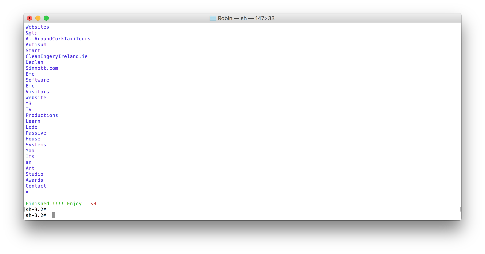

# About
This project does what it says on the tin. Send the url and it will scrap the page and parse the html from it returning the text from it.

# Installation

```shell
npm install text-scraping
```

# Usage
You need to pass one thing into it.

## Test
Run the example by running
``` npm test ```

## Code
```javascript
var text-scraping = require('text-scraping');

scraping("http://www.projectbird.com", function(response) {
console.log(response);//Returns text
});

```

# Example
As you can see
Stupid project really but a nice on all the same.


